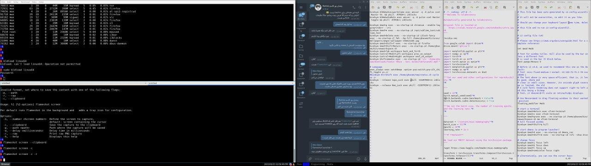
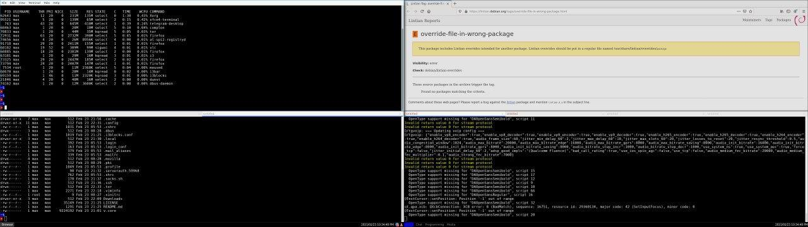

# freebsd-i3-configuration

This is my personal config for i3 and it works well on FreeBSD OS.
I know most of the configurations I found on the internet were for GNU / Linux and did not work well or had errors at BSD.

So I decided that I publish this simple configuration, Maybe one day someone will improve it.

Along with that, I have implemented interesting features for screenshots, in which scrot help.

--------------------

Reference: My previous GNU / Linux Arch distribution repository might also be useful to you:
https://github.com/BaseMax/i3-configuration

© Copyright Max Base
